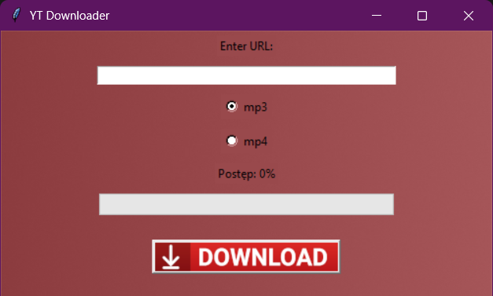
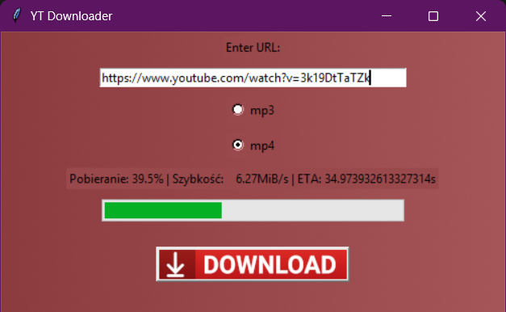

# YT-downloader-exe

🎬 **YT-downloader-exe** is a standalone executable that allows you to download any content from YouTube in MP4 or MP3 format.

<div align="center">
    
    
</div>

## Features

- **Download Videos:** Save your favorite YouTube videos in high-quality MP4 format.
- **Extract Audio:** Download audio tracks in MP3 format for offline listening.
- **User-Friendly Interface:** Simple and intuitive GUI for a smooth user experience.

## Requirements

To build and run the project from source or make any modifications, you'll need the following:

1. **Python 3.x**
   - Ensure Python is installed on your system. You can download it from [Python's official website](https://www.python.org/).

2. **Required Libraries**
   - Install necessary libraries using pip:
     ```bash
     pip install -r requirements.txt
     ```

Alternatively, manually install the following:
- yt-dlp

## Installation

1. **Download the Executable:**
   - Download the latest version of `YT-downloader-exe`.

2. **Run the Executable:**
   - After downloading, simply run the executable file. No installation required!

## Usage

1. Open the application.
2. Paste the YouTube video URL into the input field.
3. Select the desired format (MP4 or MP3).
4. Click the "Download" button to start the process.
5. The downloaded file will be saved in the same directory as the executable.

## Contributing

Contributions are welcome! If you have suggestions or improvements, feel free to create a pull request or open an issue.

## Acknowledgments

- Special thanks to the libraries and tools that made this project possible.

## Important Note

This application is intended for personal use only. The developers do not take responsibility for any misuse of the application. Please download content responsibly and adhere to YouTube's terms of service.
